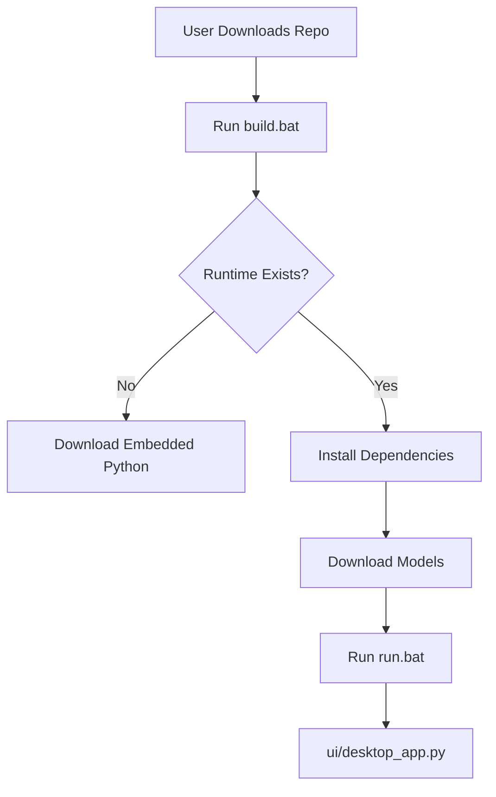

# GlobAI Architecture Deep Dive

GlobAI is engineered as a high-performance, local-first AI assistant optimized for Windows environments. It bridges the gap between complex AI research and user-friendly desktop applications.

## Core Design Principles

1.  **Local-First & Offline-Capable**: No data ever leaves the machine. All models run locally on CPU or GPU (via DirectML).
2.  **Portable Runtime**: Distributed with an embedded Python 3.10.6 environment, eliminating "Python not found" or dependency hell.
3.  **RAM-Aware Resource Management**: Dynamic loading and unloading of heavy models (LLM, Coder, SD) based on real-time RAM pressure.
4.  **CPU-First Optimization**: While supporting GPU acceleration, the system is tuned to provide a responsive experience on standard CPUs.

## System Components

### 1. The Composition Root (`app.py`)
The central orchestrator that manages mode switching, intent classification, and system-wide configuration. It ensures that only one "heavy" model is active at a time to stay within RAM limits.

### 2. Memory Management (`core/memory_manager.py`)
A sophisticated subsystem that:
- Monitors system RAM usage.
- Enforces a "RAM Ceiling" (configurable, default 88%).
- Triggers garbage collection and `torch.empty_cache()` after model unloads.
- Stabilizes the environment before switching modes.

### 3. Retrieval Augmented Generation (RAG) (`rag/`)
- **Embeddings**: Uses `sentence-transformers/all-MiniLM-L6-v2` for high-speed vectorization.
- **Vector DB**: Powered by `FAISS` for lightning-fast similarity search.
- **Hybrid Search**: Combines vector search with BM25 (keyword) retrieval for maximum accuracy.
- **Document Support**: Built-in parsers for PDF, DOCX, PPTX, and TXT.

### 4. Coder System (`coder/`)
Uses the `Qwen/Qwen2.5-Coder-0.5B-Instruct` model, optimized for local execution. It provides code completion, debugging advice, and architectural suggestions.

### 5. Image Generation (`image/`)
Integrates Stable Diffusion 1.5 using `diffusers`. It supports:
- Single-file `.safetensors` checkpoints.
- CPU/GPU execution.
- High-quality image synthesis with negative prompt support.

### 6. Desktop UI (`ui/`)
A premium PyQt6 interface featuring:
- **Dark Mode Aesthetic**: Custom CSS for a sleek, professional look.
- **Smooth Animations**: Loading overlays and transition effects.
- **Real-time Monitoring**: RAM and knowledge base status displays.

## Deployment Flow

## Model Isolation Strategy

To minimize memory footprint, GlobAI uses a strict isolation strategy:
- **RAG Mode**: Loads LLM + Embeddings.
- **Coder Mode**: Unloads RAG, loads Coder LLM.
- **Image Mode**: Unloads everything else, loads Stable Diffusion.

The `Intent Classifier` can automatically route queries to the correct system, performing these transitions transparently.
