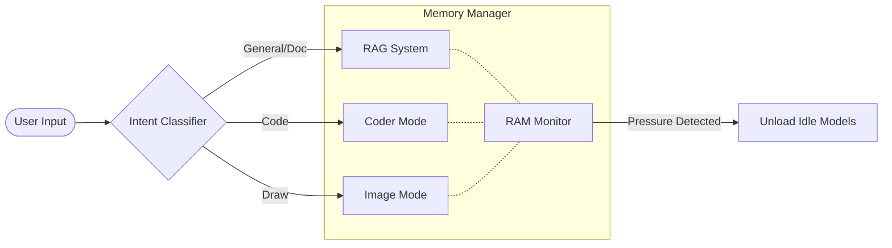

# GlobAI: The Ultimate Local AI Desktop Assistant

GlobAI is a high-performance, **fully offline-capable** desktop assistant designed for privacy-conscious developers and power users. Built with PyQt6 and optimized for Windows, it integrates **Hybrid RAG**, **Coding Assistance**, and **Image Generation** into a single, portable application.

---

## 🌟 Why GlobAI?

In a world of cloud-dependent AI, GlobAI offers a unique **CPU-first, Local-first** architecture. It doesn't just run AI; it manages it efficiently.

- **Total Privacy**: No telemetry, no cloud API keys, no data leaks.
- **Portable Runtime**: One-click setup with an embedded Python environment. No installation required.
- **RAM-Aware**: Intelligently loads and unloads models to maintain system stability even on 16GB machines.
- **Hybrid RAG**: Combines vector similarity with BM25 keyword search for pinpoint accuracy in document retrieval.

---

## 📸 Real UI in Action

| RAG Mode (Chat) | Coder Mode |
| :---: | :---: |
|  |  |

| Image Generation | Settings & Control |
| :---: | :---: |
|  |  |

---

## 🚀 Getting Started

GlobAI is designed for zero-friction deployment.

### Step 1: Initialize Environment
Run `build.bat` in the project root. This will:
1.  Download the **Portable Runtime** (Embedded Python 3.10.6).
2.  Install all required dependencies.
3.  Download optimized local models (LLM, Coder, Embeddings, SD).

### Step 2: Launch
-   **Normal Launch**: Run `run.bat` for a windowless, sleek experience.
-   **Debug Mode**: Run `debug_run.bat` to see real-time console logs and performance metrics.

---

## 🛠️ Tech Stack

-   **Frontend**: PyQt6 (Custom Dark Theme)
-   **Core Engine**: PyTorch + DirectML (Windows HW Acceleration)
-   **LLMs**: TinyLlama-1.1B, Qwen2.5-Coder-0.5B
-   **RAG**: FAISS, Sentence-Transformers, Rank-BM25
-   **Image Gen**: Stable Diffusion 1.5 (Diffusers)
-   **Document Processing**: PyMuPDF, python-docx, pypdf

---

## 🏗️ Architecture

GlobAI uses a **Model-Isolated Architecture** to ensure low RAM usage.

See [ARCHITECTURE.md](ARCHITECTURE.md) for more technical details.

---

## 🗺️ Roadmap

- [ ] **Voice Integration**: Local Whisper-based speech-to-text.
- [ ] **Multi-Model Support**: Support for GGUF/Llama.cpp integration.
- [ ] **Plugin System**: Allow community-driven tool extensions.
- [ ] **UI Themes**: Customizable glassmorphism presets.

---

## 📄 License

This project is licensed under the MIT License - see the [LICENSE](LICENSE) file for details.

---

**GlobAI** — *Private. Powerful. Portable.*
